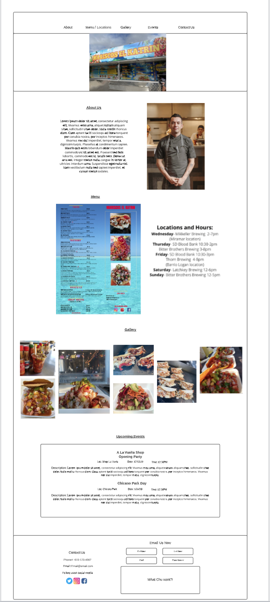
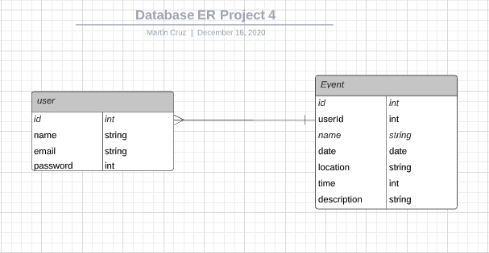

# Mariscos El Katrin

## About 

Mariscos el Katrin is a food truck business that specialises in seafood with its root in stemming from Sinaloa, Mexico with a new modern twist. The goal was to create a site where both customers can access information about Mariscos el Katrin and business owners can update customers in upcoming events.

## User Stories
As a user, I can inform myself with the business's menu, schedule, upcoming events and a little about the trucks origin.
As an owner, I can log in and access the sites CRUD features to create, display, edit and delete the trucks scheduled events.

## Languages Written In
Postgress
Express
React
Node
CSS

### User DB Model

| Column Name | Data Type | Notes |
| --------------- | ------------- | ------------------------------ |
| id | Integer | Serial Primary Key, Auto-generated |
| name | String | Must be provided |
| email | String | Must be unique / used for login |
| password | String | Stored as a hash |
| createdAt | Date | Auto-generated |
| updatedAt | Date | Auto-generated |

### Event DB Model

Column Name | Data Type | Notes |
|---------------------|-------------------|--------------------------|
| id  | Integer | Serial Primary Key, Auto-generated |
| userId | Integer | Auto-generated |
| name | String | Must be provided, user input |
| date | Date | Must be provided, user input |
| location | String | Must be provided, user input |
| time | Integer | Must be provided, user input |
| description | String | Must be provided, user input |
| createdAt | Date | Auto-generated |
| updatedAt | Date | Auto-generated |

### Wire Frames

### ERD

### Unsolved Problems/Future Features
Styling: 
At the moment the styling of the page needs to be completed.
Remove all unneeded components and move styling to pages/Home.js and App.css.
Adjust sections of page to be consistant thoughout the page.
Create photo gallery and clickable images to expand.
Clickable social media icons.
Add 'contact us' email box

Features:
Created events display on main Home page.
Clicking a header button drags page to selected section.
Connect 'contact us' email box with email.js

